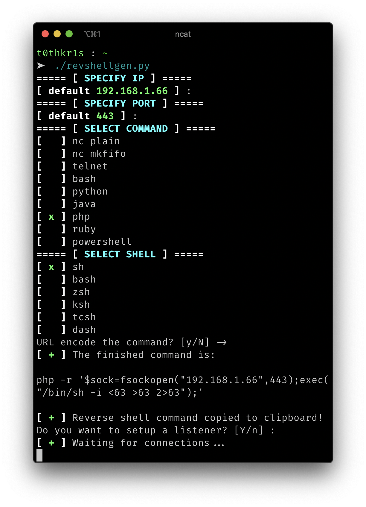

# revshellgen

Standalone python script for generating reverse shells easily and automating the boring stuff like URL encoding the command and setting up a listener.



## Download

```
git clone https://github.com/t0thkr1s/revshellgen
```

## Install

The script has 2 dependencies:

*   [pyperclip](https://pypi.org/project/pyperclip/)
*   [colorama](https://pypi.org/project/colorama/)
*   [readchar](https://pypi.org/project/readchar/)

You can install these by typing:

```
python3 setup.py install
```

### Disclaimer
> This tool is only for testing and academic purposes and can only be used where strict consent has been given. Do not use it for illegal purposes! It is the end user’s responsibility to obey all applicable local, state and federal laws. Developers assume no liability and are not responsible for any misuse or damage caused by this tool and software.

## License

This project is licensed under the GPLv3 License - see the [LICENSE](LICENSE) file for details
